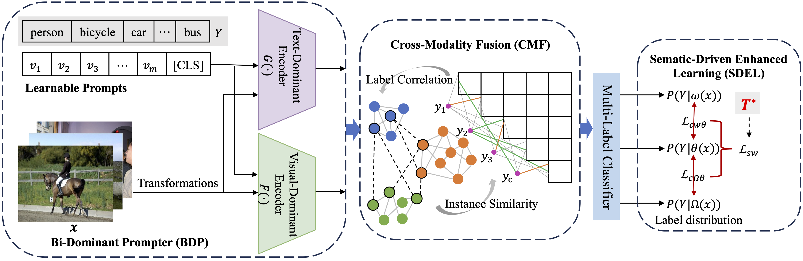

# Exploring Semantically-Driven Learning for Multi-Label Image Recognition in the Context of Partial Annotations

Official PyTorch Implementation of **SCINet**, from the following paper:

> Exploring Semantically-Driven Learning for Multi-Label Image Recognition in the Context of Partial Annotations. ACM MM 2024.

**Abstract**

In multi-label recognition (MLR) tasks, images with comprehensive annotations are time-consuming and labor-intensive, especially when dealing with a large number of labels. An extension to this paradigm, MLR with partial labels, has evolved to further address this challenge. Recent efforts have focused on leveraging the semantic relationships between labels through the learning of visual and language models, thereby compensating for the limitations of textual information. However, most studies tend to overlook the potential value exchange between different instances. In this work, we advocate for not only focusing on knowledge transfer between labels but also emphasizing information exchange between instances, to mitigate the issue of incomplete supervision information in MLR tasks due to partially labeled data. We introduce a novel and efficient framework named Semantic Co-occurrence Insight Network (SCINet). To enhance the model's understanding of context, improve feature extraction efficiency, and increase classification accuracy, we further integrate a cross-modal module specifically designed for processing and fusing textual and visual features of the input data. Additionally, through the Semantic-Driven Enhanced Learning (SDEL) method, we ensure that our model learns both the features of data and its semantic meanings. Our model demonstrates outstanding performance across several widely used benchmark datasets. Our code will be made publicly available soon.

 <table class="tg">
  <tr>
    <td class="tg-c3ow"></td>
  </tr>
</table>

## Performance

